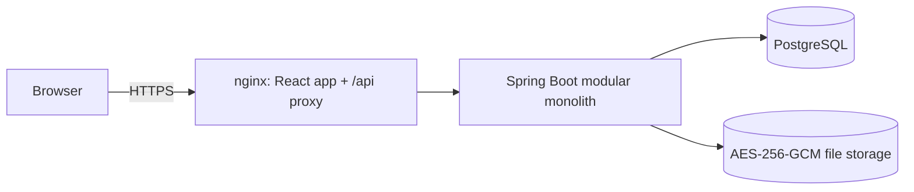
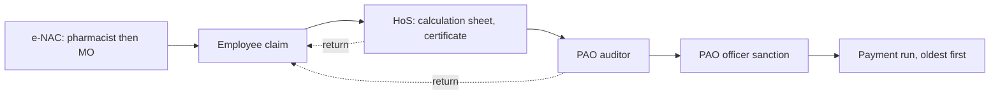

# MRMS Design Document

**Author:** Danish Husain
**Status:** living document, updated at the end of every development session
**Last updated:** 2026-09-25 (release 0.2: PDF, rates, eSign, deadlines, antivirus, shared sessions, privacy, guides, tests)

This is the single entry point to the project. It records what is being built, why, the decisions that shape it and where everything lives, so that work can resume after any break without rediscovering context. The detailed documents in [`docs/`](docs) expand on each section; this file links to them and must stay consistent with them.

---

## 1. Purpose

Digitise the outpatient medical reimbursement process (DGEHS) for employees of the **Directorate of Education, Government of NCT of Delhi**, from the dispensary's non availability certificate to payment into the salary account.

The paper process fails in five places ([problem statement](docs/01-problem-statement.md)):

| # | Failure today | Design response |
|---|---------------|-----------------|
| 1 | A five page form filled by hand for every claim | Profile data is entered once by the office; the claim form is pre filled, totals and the check list are computed |
| 2 | Dispensary NACs issued carelessly with no accountability | Item level e-NAC: the pharmacist decides each item by name, the Medical Officer countersigns, both are recorded |
| 3 | Favouritism at the school | Strict first come first served queues: officials can only "take next", never pick |
| 4 | Middlemen carrying files, bribes at the PAO | No physical file: the claim moves electronically, every touch is time stamped and attributed |
| 5 | PAO rejections for small mistakes restart the claim in the next budget cycle | "Return for correction" of only the flagged fields; the claim keeps its original queue position; processing does not wait for budget |

## 2. Scope

Release 0.1: OPD and indoor claims under DGEHS, e-NAC, school verification with calculation sheet and certificate, PAO scrutiny and sanction, budget demand, allocation and payment runs, dashboards, administration, audit.

Release 0.2 added: printable claim PDF, DGEHS rate list with suggested rates, Aadhaar eSign bound to the exact content signed, time limits with reminders, escalation and a Zonal Oversight role, e-mail and SMS through an outbox, virus scanning and standard file names, shared database sessions, a DPDP privacy notice, first login guides, and frontend and end to end tests.

Not yet (see [roadmap](docs/10-roadmap.md)): treasury integration, single sign on, Hindi interface, bulk import of HR data, OCR of bills.

## 3. Roles

Five operational roles from the brief map to seven system roles, because the dispensary and the PAO each need two people for a maker checker control. An eighth role, Zonal Oversight, follows up delays.

| Operational role | System role | Main job |
|------------------|-------------|----------|
| Employee | `EMPLOYEE` | Requests e-NACs, files and tracks claims, corrects returned claims |
| Dispensary | `PHARMACIST` | Marks each prescribed item available, not available or not admissible |
| | `MEDICAL_OFFICER` | Reviews and countersigns the pharmacist's decisions |
| Head of School | `HOS` | Restricts amounts to DGEHS rates, certifies, forwards budget demand |
| Pay and Accounts Office | `PAO_AUDITOR` | Scrutinises and admits items, recommends sanction |
| | `PAO_OFFICER` | Sanctions or rejects, records allocations, runs payments |
| System Administrator | `ADMIN` | Accounts, master data, rate lists, time limits in every zone, audit verification; never sees individual medical claims |
| Zonal office | `OVERSIGHT` | Sees delays in its education zone, sends reminders; status and dates only |

## 4. Core design decisions

Each decision has an [architecture decision record](docs/adr/README.md).

1. **Modular monolith** (Spring Boot, Spring Modulith verified boundaries) instead of microservices: one deployable, clear module seams, cheap to run in a government data centre. [ADR 0001](docs/adr/0001-modular-monolith.md)
2. **Server side sessions with CSRF tokens** instead of JWT in browser storage. [ADR 0002](docs/adr/0002-server-side-sessions.md)
3. **Strict FIFO queues and seniority that survives a return.** `first_submitted_at` is set once and orders every queue. [ADR 0003](docs/adr/0003-fifo-queues-and-seniority.md)
4. **Electronic NAC with item level, named decisions.** Only items marked not available can be claimed. [ADR 0004](docs/adr/0004-electronic-nac.md)
5. **Processing decoupled from budget.** Claims are verified and sanctioned at any time; only payment waits for funds, oldest first. [ADR 0005](docs/adr/0005-decouple-processing-from-budget.md)
6. **Hash chained, append only audit trail** written in the same transaction as the action. [ADR 0006](docs/adr/0006-hash-chained-audit-trail.md)
7. **Encrypted document storage** with content based file validation. [ADR 0007](docs/adr/0007-encrypted-document-storage.md)
8. **One portable schema** for PostgreSQL (production) and H2 (development). [ADR 0008](docs/adr/0008-portable-schema.md)
9. **Refuse unsafe text at the input boundary**, escape at the output. [ADR 0009](docs/adr/0009-input-sanitisation.md)
10. **A PAO return goes back through the HoS**, because the school certificate must cover the corrected content. Seniority puts it at the front of each queue. ([workflow](docs/05-workflow.md))
11. **Sessions in the database**, so several API instances share them. [ADR 0010](docs/adr/0010-shared-session-store.md)
12. **Signatures bound to a digest of the exact action**, by password or Aadhaar eSign. [ADR 0011](docs/adr/0011-signed-digests.md)
13. **Time limits with consequences** and an outbox for e-mail and SMS. [ADR 0012](docs/adr/0012-deadlines-with-consequences.md)

## 5. Architecture

| Module | Responsibility |
|--------|----------------|
| `shared` | Roles, principal, errors, security configuration, input sanitisation |
| `audit` | Hash chained audit trail and verification |
| `identity` | Accounts, login, lockout, password policy, sessions |
| `organisation` | PAOs, schools, dispensaries, employee profiles, dependents |
| `document` | Upload validation, encryption at rest |
| `enac` | Electronic non availability certificates |
| `claim` | Claim aggregate, workflow, queues, review |
| `budget` | Demands, allocations, payment runs |
| `rates` | DGEHS / CGHS rate lists and the applicable rate for a bill |
| `esign` | Signing: password confirmation or Aadhaar eSign |
| `escalation` | Time limit watch, escalation, oversight screen |
| `notification` | In app notifications, e-mail and SMS outbox |
| `dashboard` | Role dashboards |
| `demo` | Fictional seed data, `dev` profile only |

Rules: workflow rules live in the aggregates (`Claim`, `NacRequest`); identity comes from the session, never from the request; every read passes an object level scope check; money is `BigDecimal`; time is stored in UTC with microsecond precision. Details: [architecture](docs/04-architecture.md), [data model](docs/07-data-model.md), [API](docs/08-api.md).

## 6. Workflow summary

Submission is validated in one pass: bill count, treatment dates, 90 day window, DGEHS card validity, e-NAC coverage of medicines, required attachments, duplicate bills. Full state machines and queue rules: [workflow](docs/05-workflow.md). Paper form mapping: [form mapping](docs/13-form-mapping.md).

## 7. Security summary

Argon2id passwords with policy, history and forced first change; lockout and per IP rate limits; single session per account in a shared database store; CSRF double submit; every signature bound to the content it approves (password or Aadhaar eSign); URL, method and object level authorisation; global input sanitisation and Bean Validation; content based upload checks, active PDF rejection, ClamAV scan of every upload, AES-256-GCM at rest; strict CSP and security headers; hash chained audit trail protected by a database trigger; CodeQL, Dependabot and dependency audit in CI. Full design and threat model: [security](docs/06-security.md).

## 8. User interface

A single saffron and white theme: white boxes with rounded edges on a warm white page, deep saffron for active and primary elements. Minimal and symmetric (equal column grids, complete tile rows). Every element has a short animation that switches off under reduced motion. Separate dashboards for each role, responsive to phone width, fonts bundled locally. Full system: [UI design system](docs/09-ui-design-system.md).

## 9. Conventions

- Author on every document and commit: **Danish Husain**.
- Plain language in the UI and documents. No long dashes (em or en dash) anywhere: use commas, colons or brackets.
- Commits: imperative subject under 72 characters, body explaining why. Push small, working increments.
- Nothing private in the repository: `.env`, keys, local databases, uploads, build output and personal notes are ignored.
- Backend changes need tests; `mvn verify` also checks module boundaries. Frontend changes pass `npm run lint`, `npm test` and `npm run build`; journeys are covered by `npm run e2e`.
- Tests never depend on each other or on their order (each Spring test class gets its own database).
- Licence: PolyForm Noncommercial 1.0.0; commercial use is prohibited ([LICENSE](LICENSE), [DISCLAIMER.md](DISCLAIMER.md)).
- More: [CONTRIBUTING.md](CONTRIBUTING.md).

## 10. Where things are

| Path | Contents |
|------|----------|
| `backend/src/main/java/com/mrms/<module>` | Module code; public API in the base package, private code in `internal` |
| `backend/src/main/resources/db` | Flyway migrations (`migration` shared, `vendor/<db>` specific) |
| `backend/src/main/resources/db/rates` | Seeded CGHS 2025 rate list with its source |
| `backend/src/test` | Integration, security, modularity and unit tests |
| `frontend/src/**/*.test.tsx`, `frontend/e2e` | Frontend unit and end to end tests |
| `frontend/src/pages` | Screens per role |
| `frontend/src/components/ui` | Design system components |
| `frontend/src/styles` | Tokens, layout and component styles |
| `docker-compose.yml`, `.env.example` | Container deployment |
| `.github/workflows` | CI and CodeQL |
| `docs/` | Detailed documents and ADRs |

## 11. Resuming development

1. Read this file, then the document for the area being changed.
2. Start the API with demo data: `cd backend && mvn spring-boot:run -Dspring-boot.run.profiles=dev` (port 8080).
3. Start the web app: `cd frontend && npm install && npm run dev` (port 5173). Demo accounts are listed in the [setup guide](docs/12-setup.md).
4. Pick the next item from section 13, write the change with tests, update the affected documents and this file, commit and push.

## 12. Status

| Area | State |
|------|-------|
| Backend modules, workflow, budget, audit | Done, 70 automated tests passing |
| Release 0.2 features (section 2) | Done |
| React UI for all roles | Done; 20 unit and component tests, 4 end to end journeys |
| Docker Compose on PostgreSQL 17 with ClamAV | Done |
| CI (backend, frontend, end to end), CodeQL, Dependabot | Done |
| Documentation 01 to 17, ADRs 0001 to 0012 | Done |

## 13. Next steps

Before a pilot (decisions and registrations for the Directorate):

1. Approve the privacy notice, retention periods and grievance officer; confirm the DGEHS order adopting the CGHS 2025 rates.
2. Register as an eSign ASP with a licensed ESP; register the SMS sender and templates on DLT; arrange an SMTP relay.
3. Security audit by a CERT-In empanelled auditor; accessibility audit against GIGW.

Development (release 0.3):

4. Bulk import of schools and employees from HR data.
5. Hindi interface.
6. Treasury payment integration and single sign on.
7. OCR of bills to pre fill bill number, date and amount.

## 14. Change history

| Date | Change |
|------|--------|
| 2026-09-24 | Problem statement, proposed solution, backend foundation, e-NAC, claims, budget |
| 2026-09-25 | Frontend, deployment, CI, full documentation, release 0.1 |
| 2026-09-25 | Global input sanitisation (ADR 0009), this design document |
| 2026-09-25 | Saffron and white single theme with rounded boxes; dark mode removed |
| 2026-09-25 | Release 0.2: licence, privacy notice and guides, antivirus and naming, shared sessions, rate list, claim PDF, Aadhaar eSign, deadlines and notifications, frontend and end to end tests |

## Acknowledgements

Designed and developed by Danish Husain. AI pair programming assistance was used during development for code suggestions, reviews and documentation drafts.
