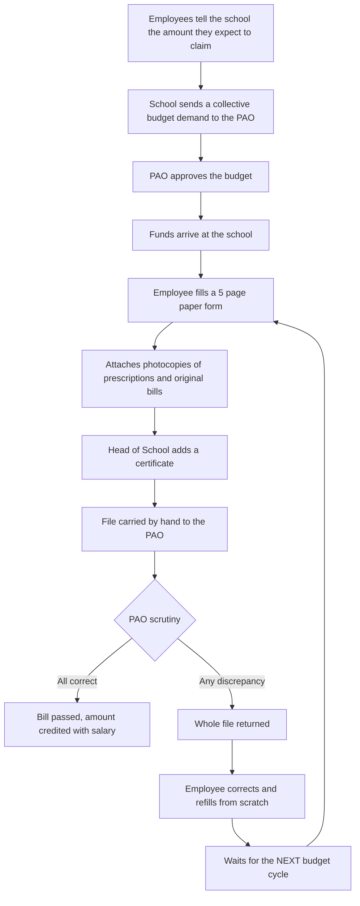

# 1. Problem Statement

**Project:** Medical Reimbursement Management System (MRMS)
**Author:** Danish Husain
**Context:** Employees (teaching and non teaching staff) working under the Directorate of Education (DoE), Government of NCT of Delhi, who claim reimbursement of outpatient medical expenses under the Delhi Government Employees Health Scheme (DGEHS).

---

## 1.1 Background

A government school employee who spends money on medicines, investigations or consultations can claim that money back. Today the entire process is paper based and moves physically between four offices: the employee, the government dispensary, the school, and the Pay and Accounts Office (PAO) that serves the school.

## 1.2 The current (manual) process

Step by step:

1. **Budget first.** Before any claim can be paid, the school must receive a medical reimbursement budget. Every employee tells the school roughly how much they expect to claim. The school totals these amounts and sends the demand to its PAO, which approves it. Only after the funds arrive can claims be processed.
2. **Application.** The employee fills a five page application form and attaches photocopies of prescriptions and the original bills for medicines, medical investigations and consultation fees.
3. **Dispensary verification (Non Availability Certificate).** Each prescription must carry the stamp of the government dispensary. The pharmacist marks which prescribed items were not available in the dispensary (the Non Availability Certificate, NAC). The Medical Officer (MO) signs and stamps to confirm the pharmacist has done this correctly. Only NAC covered items are reimbursable.
4. **School certificate.** The Head of School (HoS) attaches a certificate to the employee's documents.
5. **Physical submission.** The file is carried by hand to the PAO linked to the school.
6. **PAO scrutiny.** The PAO checks that the form is filled correctly and that every prescription carries a valid dispensary stamp and MO signature, so that only admissible items are reimbursed.
7. **Outcome.** If everything is in order the bill is passed and the amount is credited to the employee's salary account. If not, the complete file is returned. After fixing the discrepancies the employee must refill the form and wait for the **next** budget cycle.

## 1.3 Problems observed

| # | Area | Problem | Impact |
|---|------|---------|--------|
| P1 | Dispensary | NAC is sometimes issued carelessly: items that are available, or that are not admissible, still get a non availability stamp. | Wrong claims reach the PAO and are later disallowed; the employee is blamed. |
| P2 | Dispensary | Because the record is on paper, the pharmacist and the MO can each deny responsibility for a wrong NAC. | No accountability; nobody fixes the root cause. |
| P3 | School | Partiality: employees with good relations with the HoS get their bills forwarded earlier than others. | Unequal treatment; loss of trust. |
| P4 | School to PAO | A junior staff member is often made the carrier of files to the PAO and collects money from employees to "get the bill cleared". | Corruption; employees pay to get their own money. |
| P5 | PAO | Bribes are demanded at the PAO to clear bills. | Corruption; delays for those who refuse. |
| P6 | PAO | Bills are rejected for minor, correctable mistakes in the form. | Avoidable delays and repeated paperwork. |
| P7 | Budget | A returned bill must wait for the next budget cycle and the form must be filled again from scratch. | Bills pile up on top of older bills; employees wait many months. |
| P8 | Process | No one can see where a file is, who has it, or for how long. | No transparency, no way to escalate. |
| P9 | Process | Budget demand is based on rough verbal estimates collected manually. | Budgets are over or under estimated; funds lapse or fall short. |
| P10 | Data | Paper records can be lost, altered or duplicated (the same bill claimed twice). | Financial risk and audit objections. |

## 1.4 Root causes

1. **Physical movement of paper** creates gatekeepers at every hand off.
2. **No record of who decided what and when**, so there is no accountability.
3. **No queue discipline**, so files can be picked selectively.
4. **Coupling of claim processing with budget arrival**, so any correction pushes the claim to the next cycle.
5. **Binary outcome (pass or reject the whole file)** with no concept of correcting a single field.

## 1.5 Problem statement

> Design and build a secure, transparent and accountable digital system that lets DoE employees file medical reimbursement claims online with pre filled details and uploaded documents, routes each claim through dispensary verification, school verification and PAO scrutiny in a fair first come first served order, records every decision against a named official, lets returned claims be corrected and resubmitted without losing their place, and pays sanctioned claims as soon as budget is available, so that delays, partiality, middlemen and bribery are removed from the process.

## 1.6 Stakeholders

| Stakeholder | Interest |
|-------------|----------|
| Employee (teacher, lab assistant, clerk, etc.) | Fast, fair, predictable reimbursement with no middlemen. |
| Pharmacist (government dispensary) | Record item level availability quickly. |
| Medical Officer (government dispensary) | Countersign verified prescriptions; clear accountability. |
| Head of School (HoS) | Verify staff claims and forward them without paperwork. |
| PAO Auditor / Dealing Assistant | Scrutinise claims with all documents in one place. |
| PAO Officer (sanctioning authority) | Sanction and release payments; manage school budgets. |
| Directorate of Education (administration) | Oversight, reports, SLA monitoring, policy configuration. |

## 1.7 Out of scope for the first release

- Direct integration with the treasury / salary payment system (payment is recorded with a transaction reference; integration is on the roadmap).
- In patient (hospitalisation) claims and advances.
- Aadhaar based e-sign (planned; see the roadmap).
