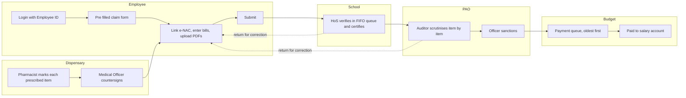

# 2. Proposed Solution

**Author:** Danish Husain

MRMS replaces the paper file with a single digital claim that moves through the same offices, but where every action is time stamped, attributed to a named official, visible to the employee and bound by rules the officials cannot bypass.

---

## 2.1 Target flow

## 2.2 How each problem is addressed

| Problem | Feature | How it helps |
|---------|---------|--------------|
| P1, P2 dispensary accountability | **e-NAC (electronic Non Availability Certificate).** The pharmacist marks every prescribed item as *Available*, *Not available* or *Not admissible*. The Medical Officer reviews and countersigns. Each decision is stored with the user, time and reason. | A wrong NAC can be traced to the exact person who made it. The employee can raise a dispute on any item. |
| P3 school partiality | **Strict FIFO work queue.** The HoS sees claims in submission order and can only open the oldest pending claim first. **SLA timer**: if a claim waits longer than the configured days it is flagged and escalated. | Nobody can be served out of turn. Delays become visible to the Directorate. |
| P4, P5 middlemen and bribery | **No physical movement.** Claims move digitally from the employee to the HoS to the PAO. The employee can see the current desk, the person and the time spent at each step. | There is no file to carry and nothing to "get cleared". Every delay is attributable. |
| P6 rejection for minor issues | **Validation at entry** (the form cannot be submitted with missing or inconsistent data). **Return for correction** with standard reason codes is separate from **Reject**, which is allowed only for genuinely inadmissible claims and needs a written reason reviewed by the officer. | Minor issues are fixed in minutes, not in months. |
| P7 waiting for the next budget | **Processing decoupled from budget.** Claims are verified and sanctioned at any time; only the final payment waits for funds. **Seniority retained**: a returned and corrected claim keeps its original submission time in every queue. **Amend, do not refill**: only the flagged fields are edited. | A correction never sends a claim to the back of the line or to the next financial year. |
| P8 no transparency | **Live claim tracker** with a timeline of every step, plus in app notifications. | The employee always knows where the claim is. |
| P9 rough budget demand | **Automatic demand aggregation.** The school demand is calculated from the claims actually filed and awaiting payment. The HoS forwards it to the PAO with one click. | Budgets match real need. |
| P10 lost, altered or duplicate papers | **Tamper evident audit trail** (each entry is hash chained to the previous one) and **duplicate bill detection** (file fingerprint plus bill number and vendor). | Records cannot be silently changed; the same bill cannot be claimed twice. |

## 2.3 Additional suggestions included in the design

1. **Maker checker at the PAO.** An auditor scrutinises and records admissible amounts; a separate officer sanctions. One person cannot both verify and approve.
2. **Item level admissibility.** The PAO can disallow a single item with a reason instead of rejecting the whole claim; the rest of the claim is paid.
3. **Standard reason codes** for returns and disallowances (for example *Bill not legible*, *Item not covered by NAC*, *Amount mismatch*). This makes objections consistent across PAOs and allows reporting on the most common problems.
4. **Dependents register.** Family members eligible under DGEHS are recorded once in the employee profile and selected from a list when filing a claim.
5. **Pre filled profile.** Name, designation, school, pay level, DGEHS card number and bank details come from the employee master and cannot be edited by the employee in the claim.
6. **Draft auto save** so an employee can prepare a claim over several sessions.
7. **Dashboards per role** with counts, ageing and SLA breaches, and a Directorate view across all schools.
8. **Security by default** (see [06-security.md](06-security.md)): server side sessions, CSRF protection, Argon2id password hashing, account lockout, rate limiting, strict upload validation, object level authorisation and security headers.
9. **Accessibility and usability.** Keyboard friendly, a single high contrast saffron and white theme, reduced motion support, plain language labels and inline help.

## 2.4 Features planned for later releases

These are listed in [10-roadmap.md](10-roadmap.md): Aadhaar e-sign for HoS and MO certificates, SMS / email notifications, treasury (PFMS / e-Kosh) payment integration, Hindi language support, OCR on bills, analytics for dispensary stock outs, and a grievance module linked to the Directorate.
