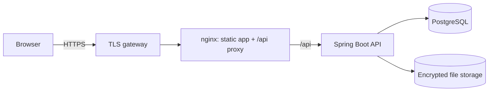
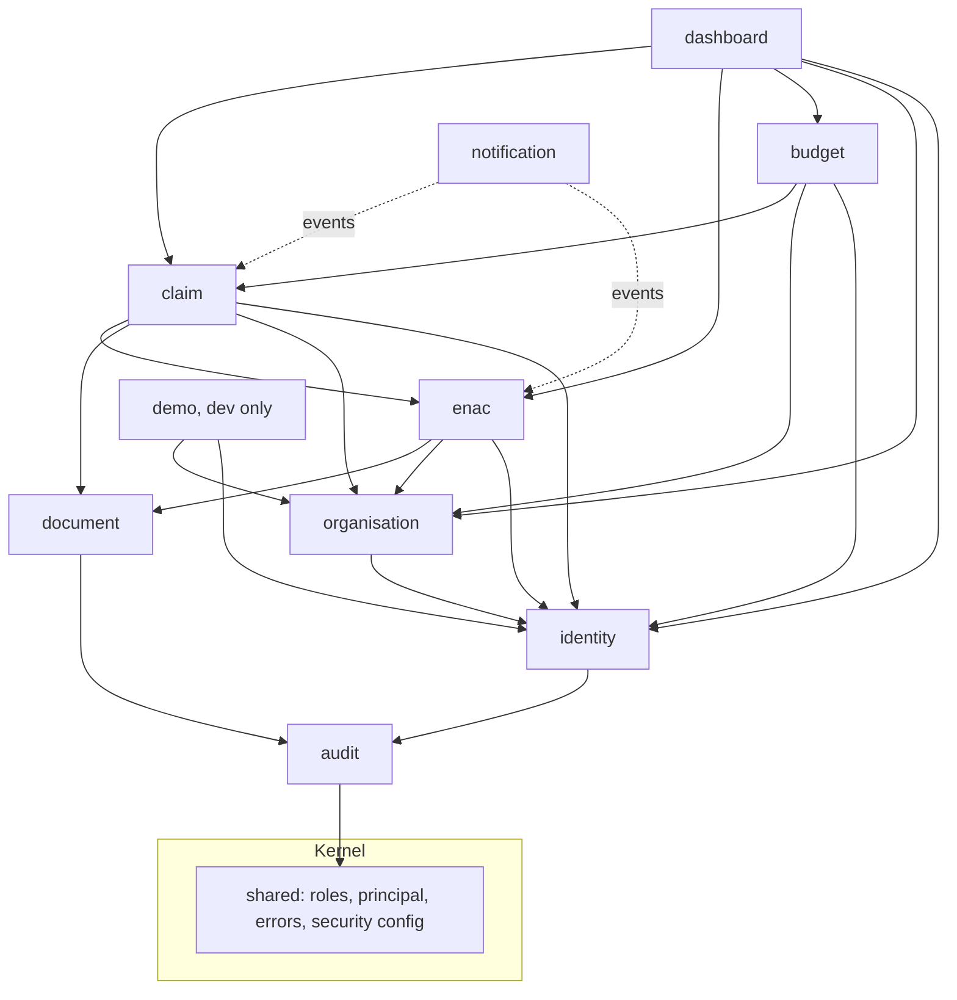
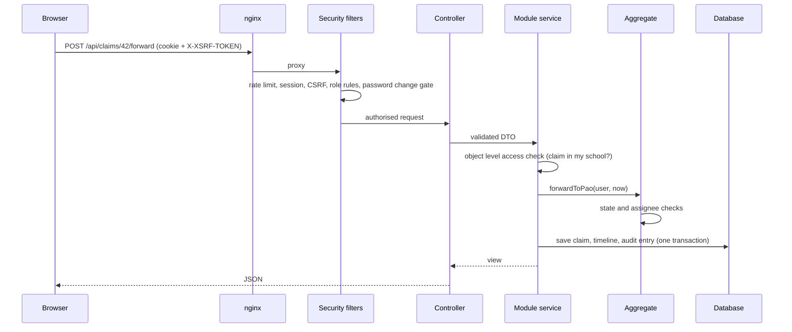

# 4. Architecture

**Author:** Danish Husain

## 4.1 Overview

MRMS is a **modular monolith**: one deployable Spring Boot application whose code is split into business modules with explicit, verified boundaries, plus a React single page application served by nginx.

Why a modular monolith and not microservices is recorded in [ADR 0001](adr/0001-modular-monolith.md).

## 4.2 Modules

Every direct sub package of `com.mrms` is a module. A module exposes a small public API in its base package; everything under `internal` is private. `ModularityTests` fails the build if a module reaches into another module's internals or if dependencies form a cycle.

| Module | Responsibility | Public API |
|--------|----------------|------------|
| `shared` | Roles, authenticated principal, error model, security configuration | open module |
| `audit` | Append only, hash chained audit trail | `AuditTrail` |
| `identity` | Accounts, login, lockout, password policy, sessions | `Accounts` |
| `organisation` | PAOs, schools, dispensaries, employee profiles, dependents | `OrganisationDirectory`, `OrganisationAdmin` |
| `document` | Upload validation, encryption at rest, storage | `DocumentStore` |
| `enac` | Electronic non availability certificates | `NacLookup`, `NacStatusChanged` |
| `claim` | Claim aggregate, workflow, queues, review | `ClaimPayments`, `ClaimStatistics`, `ClaimStatusChanged` |
| `budget` | Demands, allocations, payment runs | `BudgetQueries` |
| `notification` | In app notifications from domain events | none (listener only) |
| `dashboard` | Role dashboards composed from other modules | none (controller only) |
| `demo` | Fictional seed data, `dev` profile only | none |

Modules communicate in two ways:

1. **Synchronous API calls** for queries and commands that must succeed together (for example, the budget module marking claims paid).
2. **Domain events** (`ClaimStatusChanged`, `NacStatusChanged`) for reactions that other modules should not know about (notifications). Listeners run in the same transaction, so a notification exists exactly when its status change was committed.

## 4.3 Request flow

## 4.4 Key design rules

- **Workflow rules live in the aggregate.** `Claim` and `NacRequest` expose methods such as `forwardToPao` and `countersign`; each checks the current status and the acting user. Controllers cannot change status directly.
- **Identity comes from the session, never from the request body.** Services call `CurrentUser` to learn who is acting.
- **Object level authorisation.** Every read of a claim, certificate or document goes through a scope check (own record, my school, my PAO, my dispensary). Out of scope records are reported as not found.
- **Seniority is data.** `first_submitted_at` (claims) and `queue_since` (certificates) are set once and drive every queue.
- **Money is `numeric(12,2)` / `BigDecimal`.** No floating point in amounts.
- **Time is UTC in storage** with microsecond precision; the UI shows Indian Standard Time.

## 4.5 Technology

| Layer | Choice |
|-------|--------|
| Language | Java 21 |
| Framework | Spring Boot 4.1, Spring Security 7, Spring Data JPA (Hibernate 7) |
| Module checks | Spring Modulith 2.1 (`ApplicationModules.verify()`) |
| Database | PostgreSQL 17 (production), H2 in PostgreSQL mode (development and tests) |
| Migrations | Flyway (shared scripts plus vendor specific scripts) |
| Frontend | React 19, TypeScript, Vite, React Router, TanStack Query, React Hook Form, Motion |
| Serving | nginx (unprivileged image) with strict security headers |
| CI | GitHub Actions: tests, lint, build, dependency audit, CodeQL, Dependabot |

## 4.6 Deployment

`docker-compose.yml` runs PostgreSQL, the API and nginx. Only nginx is published and only on the loopback address; the database and API sit on an internal network. Containers run as non root with read only file systems. See [12-setup.md](12-setup.md).
