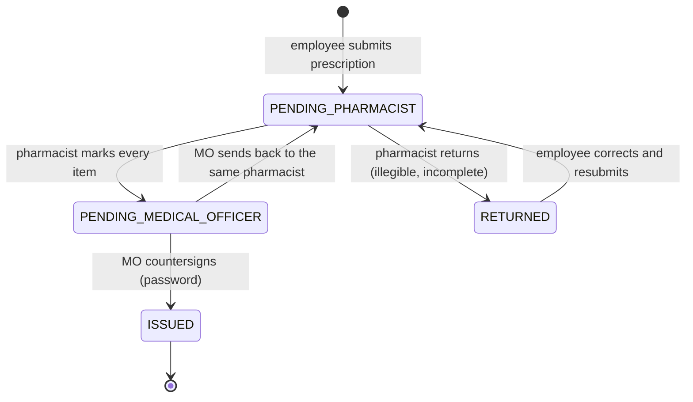
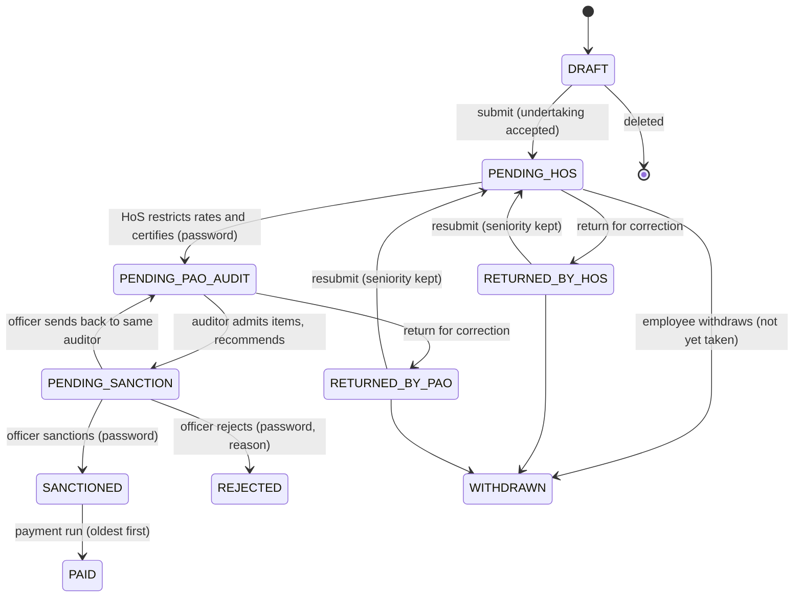
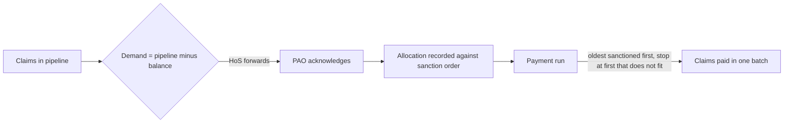

# 5. Claim and e-NAC Workflow

**Author:** Danish Husain

## 5.1 e-NAC (electronic Non Availability Certificate)

Item decisions:

| Decision | Meaning | Claimable |
|----------|---------|-----------|
| Available | Given from dispensary stock | No |
| Not available | Not in stock; may be bought | **Yes** |
| Not admissible | Not allowed under DGEHS (reason required) | No |

The certificate number is `NAC/<dispensary code>/<financial year>/<serial>`.

## 5.2 Claim

### Why a PAO return goes back through the HoS

The HoS certificate and calculation sheet describe the content of the claim. After a correction that content has changed, so the school must certify it again. Because the claim keeps its original submission time, it goes straight to the **front** of the HoS queue and then of the PAO queue, so the extra step costs hours, not a budget cycle.

## 5.3 Queues

| Queue | Stage | Scope | Default SLA |
|-------|-------|-------|-------------|
| Pharmacist | `PENDING_PHARMACIST` | dispensary | 2 days |
| Medical Officer | `PENDING_MEDICAL_OFFICER` | dispensary | 2 days |
| Head of School | `PENDING_HOS` | school | 3 days |
| PAO auditor | `PENDING_PAO_AUDIT` | PAO | 7 days |
| PAO officer | `PENDING_SANCTION` | PAO | 3 days |

Rules:

1. **Order** is by first submission time (claims) or first request time (certificates), then by id. It never changes when a record is returned and resubmitted.
2. **Take next** gives the official the record they already hold, otherwise the oldest untaken record. There is no way to open and act on an arbitrary record.
3. **Release** puts a record back; because order is by seniority it becomes the head of the queue again.
4. **SLA** is measured from when the record entered its current stage. Breaches appear on dashboards (Directorate view included).
5. When the officer sends a claim back, it is assigned to the auditor who scrutinised it; when the MO sends a certificate back, it goes to the pharmacist who decided it. The person who made the decision corrects it.

## 5.4 Validation at submission

A claim cannot leave the employee unless:

- it has at least one bill and at most 50;
- treatment dates are consistent and not in the future, and every bill date is inside the treatment period;
- it is submitted within 90 days of the end of treatment (first submission only);
- indoor treatment has admission and discharge dates and a discharge summary;
- the DGEHS card on record covers the treatment period and a copy is attached;
- OPD medicines are linked to issued e-NAC items for the same patient (or to a scanned paper NAC during transition);
- an OPD claim without e-NAC items has a prescription attached; an emergency claim has an emergency certificate;
- no bill file, identical file content, bill number of the same vendor and date, or e-NAC item is part of another active claim.

All problems are reported together so the employee can fix them in one pass.

## 5.5 Budget and payment

Payment batches are numbered `PB/<school code>/<financial year>/<serial>` and the batch reference is shown on every paid claim.
