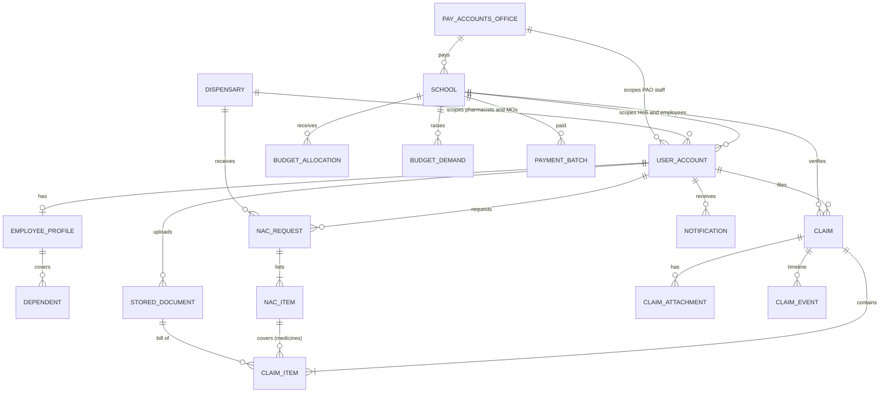

# 7. Data Model

**Author:** Danish Husain

The schema is created by Flyway (`backend/src/main/resources/db/migration`). Tables are grouped by the module that owns them; a module never writes another module's tables.

## 7.1 Tables by module

### identity
| Table | Purpose | Notes |
|-------|---------|-------|
| `user_account` | Login accounts | `role`, office scope (`school_id` / `dispensary_id` / `pao_id`), lockout fields, `must_change_password`, optimistic `version` |
| `password_history` | Previous password hashes | used to prevent reuse |

### organisation
| Table | Purpose | Notes |
|-------|---------|-------|
| `pay_accounts_office` | PAOs | unique `code` |
| `school` | Schools | unique School ID `code`, `pao_id` |
| `dispensary` | DGEHS dispensaries (AMA) | unique `code` |
| `employee_profile` | Service, DGEHS and bank details | fields follow Annexure II; `bank_account_masked` only |
| `dependent` | Family members | deactivated, never deleted |

### document
| Table | Purpose | Notes |
|-------|---------|-------|
| `stored_document` | Metadata of uploaded files | UUID id, `sha256` of content, random `storage_key`; rows are immutable |

### enac
| Table | Purpose | Notes |
|-------|---------|-------|
| `nac_request` | Certificate request | `status`, `queue_since` (seniority), `stage_entered_at` (SLA), `assigned_to`, pharmacist and MO signatures, `nac_number` when issued |
| `nac_item` | Prescribed item | `decision`, `decision_reason`, `decided_by`, `decided_at` |

### claim
| Table | Purpose | Notes |
|-------|---------|-------|
| `claim` | Claim header | patient, treatment (OPD / indoor), hospital, three amounts (claimed, restricted, admitted), `first_submitted_at` (seniority, set once), `stage_entered_at`, `assigned_to`, signatures of HoS, auditor, officer, payment batch |
| `claim_item` | One bill | category, bill details, DGEHS code and rate, restricted and admitted amounts with reasons, `nac_item_id` or `legacy_nac`, `bill_document_id` |
| `claim_attachment` | Supporting documents | unique per claim and document |
| `claim_event` | Human readable timeline | immutable |

### budget
| Table | Purpose | Notes |
|-------|---------|-------|
| `budget_allocation` | Funds released to a school | per financial year, sanction order number, immutable |
| `budget_demand` | Demand raised by a school | `RAISED`, `ACKNOWLEDGED` or `SUPERSEDED` |
| `payment_batch` | One payment run | `batch_ref`, total, count, immutable |

### notification
| Table | Purpose |
|-------|---------|
| `notification` | In app messages with read state |

### audit
| Table | Purpose | Notes |
|-------|---------|-------|
| `audit_entry` | Append only trail | `prev_hash`, `hash`; UPDATE / DELETE / TRUNCATE blocked by trigger on PostgreSQL |
| `audit_chain_head` | Single row pointing at the newest entry | locked while appending |

## 7.2 Sequences and numbers

| Sequence | Format |
|----------|--------|
| `claim_number_seq` | `MR/<school code>/<financial year>/<6 digits>` |
| `nac_number_seq` | `NAC/<dispensary code>/<financial year>/<6 digits>` |
| `payment_batch_seq` | `PB/<school code>/<financial year>/<5 digits>` |

## 7.3 Conventions

- Primary keys are identity columns except documents, which use random UUIDs so ids cannot be guessed.
- Amounts are `numeric(12,2)` (`numeric(14,2)` for budget totals).
- Timestamps are `timestamp with time zone`, stored in UTC with microsecond precision.
- Enumerations are stored as their names (`varchar`), never as ordinals.
- Aggregates that users edit concurrently (`claim`, `nac_request`, `user_account`) carry an optimistic lock `version`.
