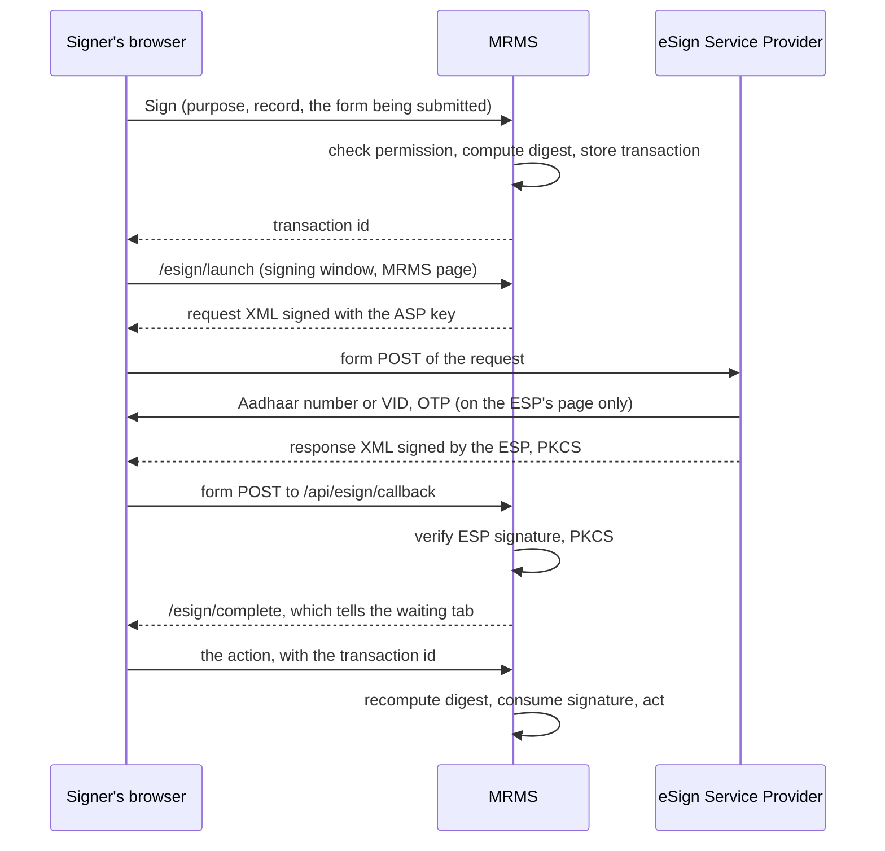

# 15. Signing and Aadhaar eSign

**Author:** Danish Husain

## 15.1 What is signed

Five actions carry legal weight and are signed by the person taking them:

| Purpose code | Action | Signer |
|--------------|--------|--------|
| `CLAIM_HOS_CERTIFY` | Calculation sheet and Head of School certificate, forwarding to the PAO | Head of School |
| `NAC_COUNTERSIGN` | Countersignature that issues an e-NAC | Medical Officer |
| `CLAIM_SANCTION` | Sanction of a claim | PAO officer |
| `CLAIM_REJECT` | Rejection of a claim | PAO officer |
| `PAYMENT_RUN` | Release of a payment batch | PAO officer |

## 15.2 Two modes

| Mode | How the signer confirms | Setting |
|------|-------------------------|---------|
| Password (default) | Re-enters their password; a wrong password counts towards lockout | `MRMS_SIGNING_MODE=password` |
| Aadhaar eSign | Signs at a licensed eSign Service Provider (ESP) with Aadhaar OTP or biometric | `MRMS_SIGNING_MODE=esign` |

The development profile runs in eSign mode against a built in simulator (OTP `123456`), so the whole flow can be tried without any registration. Tests cover both modes.

## 15.3 What a signature covers

Every signed action has a **digest**: the SHA-256 of a canonical text of exactly what is being approved. For the Head of School certificate that is the claim's content fingerprint (every item, amount, document hash), the rate basis, every restriction and remark on the calculation sheet, and the certificate text. For a payment run it is the list of claims the run will pay and the total.

1. Before signing, the owning module checks that the user may take the action now and computes the digest.
2. The ESP signs that digest with a short lived certificate issued in the signer's name.
3. When the action executes, the module computes the digest again from the request that is about to run. If anything changed (a remark, an amount, a new claim in the payment queue), the digests differ and the action is refused with `ESIGN_MISMATCH`.
4. A signature confirms one action only; afterwards it is marked consumed.

So what was signed is always exactly what happened.

## 15.4 Aadhaar eSign flow

Security properties:

- **No Aadhaar number in MRMS.** It is typed only on the ESP's page. MRMS stores the signer's certificate name, serial and issuer, the PKCS#7 signature and the digest.
- **Request authenticity.** Every request is an XML signature (RSA-SHA256, enveloped) made with the Directorate's ASP key.
- **Response authenticity.** The response's XML signature must verify against the configured ESP certificate; a certificate carried inside the message is ignored, so a forged response signed by anyone else is refused (tested).
- **Signature validity.** The PKCS#7 must be SHA-256, from exactly one signer, over exactly the stored digest, and the signer's certificate must chain to a configured trusted CA (the Controller of Certifying Authorities root and the ESP's CA) and be valid at signing time.
- **XML parsing** has DTDs, external entities and XInclude disabled.
- **The callback** needs no session (the browser does not send SameSite=Strict cookies on a cross site post) and is exempt from CSRF and origin checks; it is protected by the ESP's signature and a random single use transaction id that expires after 10 minutes.
- **Popup blockers.** The signing window shows an MRMS page that posts the request to the ESP. If the browser blocks the window, the dialog offers a plain link to the same page.

## 15.5 Going live with eSign

1. The Directorate registers as an Application Service Provider with a licensed ESP (for example through the eSign framework of the Controller of Certifying Authorities) and receives an ASP id, the ESP's endpoint, its signing certificate and CA certificates.
2. Generate the ASP key pair and certificate as the ESP requires, and store them in a PKCS#12 keystore outside the image (for example a Docker secret).
3. Configure the backend:

   | Variable | Value |
   |----------|-------|
   | `MRMS_SIGNING_MODE` | `esign` |
   | `MRMS_ESP_NAME` | Name shown to users |
   | `MRMS_ESP_ASP_ID` | ASP id |
   | `MRMS_ESP_URL` | ESP signing endpoint |
   | `MRMS_PUBLIC_BASE_URL` | Portal address (the ESP returns users to `/api/esign/callback`) |
   | `MRMS_ESP_ASP_KEYSTORE`, `MRMS_ESP_ASP_KEYSTORE_PASSWORD`, `MRMS_ESP_ASP_KEY_ALIAS` | ASP key |
   | `MRMS_ESP_CERTIFICATES` | PEM file with the ESP's response signing certificate(s) |
   | `MRMS_ESP_TRUSTED_CAS` | PEM file with the CCA root and the ESP's CA |
   | `MRMS_ESP_REQUEST_FIELD`, `MRMS_ESP_RESPONSE_FIELD` | Form field names, if the ESP's kit differs from `eSignRequest` / `eSignResponse` |

4. Set `MRMS_ESP_ORIGIN` on the web container so the content security policy allows the form post to the ESP.
5. Check the request attributes against the ESP's integration kit (API version, `AuthMode`, `ekycIdType`), run a signing in the ESP's test environment, and consider enabling OCSP checks of signer certificates if the Directorate's policy requires them.

The simulator refuses to start outside the dev and test profiles.

## 15.6 Records

Every step is audited: `ESIGN_STARTED`, `ESIGN_SIGNED`, `ESIGN_FAILED`, `ESIGN_RESPONSE_REJECTED`, `ESIGN_CONTENT_MISMATCH`, `ESIGN_USED`. The printed claim lists each signature with its method, signer, certificate and the signed digest.
